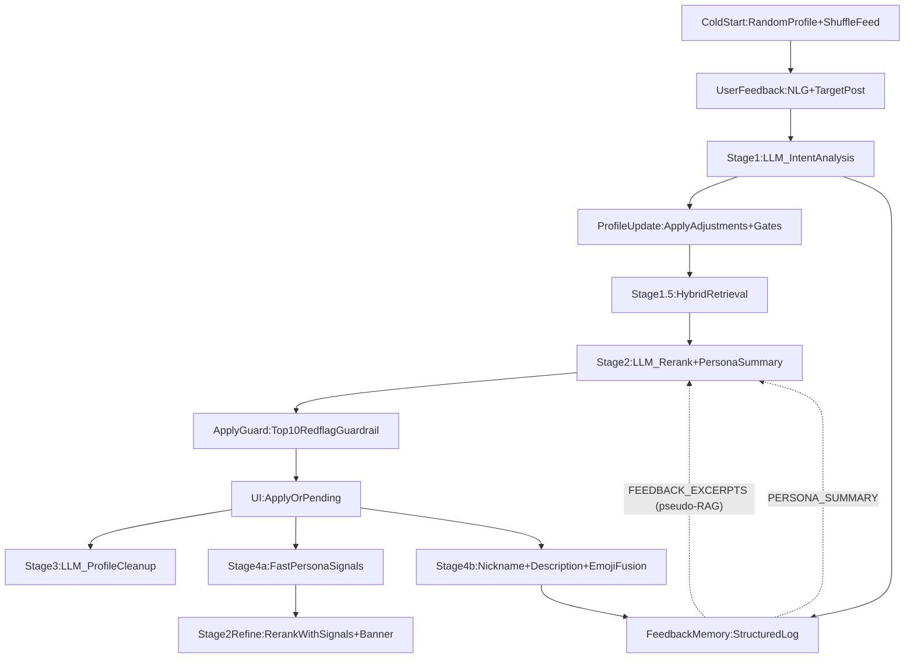

**Demo active on(require groq key or password): https://tanchuping.github.io/LLM-Feedback-SocialMediaPushSystem/**
<table>
  <tr>
    <td width="200"></td>
    <td>This repository reflects an ongoing learning process rather than a finished system. Design choices are intentionally simple, explicit, and sometimes imperfect, with the goal of understanding engineering trade-offs rather than maximizing performance.</td>
  </tr>
</table>


## Motivation

Most recommendation systems infer user preferences indirectly from clicks, likes, and dwell time. While effective at scale, these signals:

* are ambiguous and noisy,
* do not capture *why* a user dislikes something,
* can reinforce incorrect assumptions about user intent (e.g., liking or viewing community college content does **not** mean the user is “poorly performing”; they may be disciplined, cost‑conscious, and planning a transfer).

Large language models make it tempting to let AI directly control recommendations. However, this raises practical concerns around:

* controllability and safety,
* over-correction from emotional or noisy feedback,
* high cost, high consumption of tokens

This project explores a more conservative design:

> **Use an LLM only as a semantic translator — converting natural-language feedback into structured preference adjustments — while keeping all ranking decisions inside a transparent, rule-based system.**  
> Users should be able to say “I dislike this angle” without burying an entire topic; nuance is handled in the translation layer, not by suppressing whole subjects.

The emphasis is on engineering clarity, not model sophistication.

---

## How does it work

The system runs entirely client-side to demonstrate immediate responsiveness and to keep the feedback loop easy to inspect.

### System Pipeline (Linear)



**Workflow (step-by-step):**

1. **Cold Start (Randomization)**
   - On load, a random User Profile is generated (few low-weight tags).
   - The feed is shuffled for diversity.

2. **User Feedback**
   - User clicks "..." and submits natural-language feedback on a target post.

3. **Stage 1: Intent Analysis (LLM)**
   - Produces structured outputs:
     - **tag adjustments** (interest/dislike deltas on tags in the master vocabulary)
     - **explicit_search_query** (optional; bilingual tokens encouraged)
     - **dislike_scope**: `topic` vs `aspect`
     - **soft_downrank_query** (optional; aspect-level downrank phrase)
     - **preference_targets**: explicit targets (`entity` / `aspect` / `topic`)

4. **Profile Update (Deterministic, with guardrails)**
   - Applies Stage 1 adjustments into the User Profile (interests/dislikes), but with two key safeguards:
     - **Topic-dislike gate (anti over-correction)**:
       - If `dislike_scope="topic"` and the user did NOT clearly say “stop showing” (or it’s not repeated enough), we still apply a **mild** dislike but clamp magnitude to **≤ 3**.
       - If the gate is triggered (explicit stop or repeated negatives), we apply Stage 1’s full magnitude (can be large).
     - **Aspect guardrail (avoid collateral damage)**:
       - If `dislike_scope="aspect"`, we avoid converting the target post’s SUBJECT tag into a persistent profile dislike.
       - Instead, we rely on **soft downrank rules** (e.g., `soft_downrank_query="nerd"`) + Stage 2 semantics.
       - This is why you might see a Stage 1 “dislike adjustment” in logs, but not see it show up in **Negative Filters**.

5. **Stage 1.5: Hybrid Retrieval (Candidate Pool)**
   - Builds the candidate list that Stage 2 will reorder:
     - **No explicit search**: profile-scored top candidates
     - **With explicit search**: merge **Pool A (profile top)** + **Pool B (deterministic keyword search)**
   - Applies deterministic **soft downrank** before Stage 2:
     - recent per-feedback aspect rules
     - Stage4 `red_flag_keywords`
     - entity/aspect dislikes (stable exceptions)

6. **Stage 2: LLM Rerank (with rich context)**
   - Reorders candidates using:
     - current profile, recent feedback history
     - persona signals (`user_traits`, `red_flags`, `red_flag_keywords`)
     - full persona description (`PERSONA_SUMMARY`, ~400 chars, from previous Stage 4b)
     - raw feedback excerpts (`FEEDBACK_EXCERPTS`, pseudo-RAG keyword retrieval from Feedback Memory — provides ground-truth user words when persona summary is ambiguous)
     - stable exceptions (`ENTITY_DISLIKES`, `ASPECT_DISLIKES`)
     - primary/secondary tags per post (so “Nightlife is primary, Music is secondary” is explicit)

7. **Top10 Redflag Guardrail (Post-LLM, deterministic)**
   - After Stage 2 returns IDs, a small deterministic pass enforces:
     - items matching `HARD_AVOID_POST_IDS`, `ENTITY_DISLIKES`, or `red_flag_keywords` must not appear in **Top 10** (if enough safe candidates exist).
   - This prevents “LLM didn’t follow instructions” regressions while keeping the rest of the list LLM-driven.

8. **Stage 3: Forgetting / Cleanup (Background)**
   - Asks an LLM to propose small negative deltas to decay irrelevant tags.
   - Updated behavior:
     - **No forced decay**: if nothing is clearly irrelevant, it can output empty decay.
     - **Grace period**: tags that were **just boosted** are passed as `RECENTLY_BOOSTED_TAGS` and should not be immediately decayed.

9. **Stage 4: Persona (Background, split)**
   - **Stage 4a (fast, strong model)**: emits `user_traits`, `red_flags`, `red_flag_keywords` → immediately triggers a refined Stage 2 rerank + UI banner.
   - **Stage 4b (slow UI)**: nickname/description/emoji fusion updates the UI only (no further rerank). The generated persona description is also stored in Feedback Memory and fed back to Stage 2 as `PERSONA_SUMMARY`.

**Note (Nuance without collateral damage):**
- When feedback criticizes an *aspect* (framing/bias/conduct) rather than the *topic* itself, the system stores **downrank-only red flags** so the deterministic ranker pushes down matching posts **without killing the topic tag**.
- Stage 4 summarizes durable `red_flags` (human readable) + `red_flag_keywords` (matchable phrases, max 5) so later refreshes can apply consistent aspect-level downranking without extra LLM calls.
- Topic-level dislikes are intentionally harder to trigger (explicit stop intent or repeated negatives), to reduce umbrella-tag collateral damage.

**Feedback Memory (Client-side Structured Log + Pseudo-RAG):**

Each feedback cycle records a structured entry containing the raw user input, Stage 1 analysis (adjustments, dislike_scope, user_note, preference_targets), a profile snapshot, and the persona summary (backfilled once Stage 4b completes). This serves three purposes:
1. **Transparency**: users can inspect the full history of how their feedback was interpreted via the Dashboard's "Memory" tab.
2. **Active pseudo-RAG retrieval**: when building Stage 2 context, the system performs keyword matching (using `red_flag_keywords`, `ENTITY_DISLIKES`, `ASPECT_DISLIKES`) against `searchableText` in memory entries. Matched entries are injected as `FEEDBACK_EXCERPTS` — raw user words that Stage 2 can use as ground-truth evidence when persona summary alone is ambiguous. No extra LLM calls are made; retrieval is pure client-side string matching.
3. **Stage 4 enrichment**: structured entity/aspect dislikes from memory are appended to the feedback history passed to Stage 4a/4b, improving red_flag extraction reliability especially for vulgar or ambiguous feedback.

*DEMO (please wait a moment for the 4 GIFs to load)
1/4.

2/4.

3/4.

4/4.


---
## Ranking Model (Current Version)

The feed is ordered using a **weighted linear scoring model**. To solve the semantic ambiguity of tags (e.g., a "Gaming" tag on a "Party" post), we introduced **Per-Post Tag Weights**.

For each post:

```
score(post) = popularity_bias(post)
            + weighted_interest_reward(user, post)
            − weighted_dislike_penalty(user, post)
            + exploration_noise
```

---

### A. Popularity Bias

A small baseline favoring broadly liked content:

```
popularity_bias = log10(likes + 1) * k_pop
```

* The logarithm smooths extreme head effects.
* Allows newer or niche content to surface.

---

### B. Weighted Interest Reward

We calculate relevance by multiplying the user's interest strength by the tag's importance within the specific post:

```
interest_reward = Σ ( user_interest[tag] * post_tag_relevance * k_like )
```

* **user_interest**: How much the user likes the topic (from profile).
* **post_tag_relevance**: How central the topic is to this specific post (e.g., 2.0 for Core Topic, 0.5 for Vibe).

This distinction ensures that liking "Social" boosts a Nightclub post (Social: 2.5) much more than a Gaming post that happens to have a chat feature (Social: 0.2).

---

### C. Dislike Penalty & Veto Power

Handling dislikes requires nuance. We implemented a **Veto Mechanism** to prevent collateral damage.

```
impact = user_dislike[tag] * post_tag_relevance
```

1. **Standard Penalty**: If `impact` is low, we simply subtract from the score.
2. **Hard Veto**: If `impact > VETO_THRESHOLD`, the post receives a massive penalty (effectively removed).

---

### D. Exploration Noise

A small random perturbation used only to break ties between similarly scored items.

---

## User Profile Representation

The user profile is a lightweight structure containing:

* positive tag weights (`interests`)
* negative tag weights (`dislikes`)
* optional metadata or coarse user hints

Weights are adjusted incrementally and are not learned from large offline datasets.

---

## Role of the LLM

The LLM is used strictly for **semantic translation**, not ranking.

### Interactive Demo Walkthrough

To observe the system in action:

1.  **Click the "..." (More) button** on the top-right of any post card.
2.  **Select or Type Feedback**: Enter a natural language reason (e.g., *"I'm tired of technical debates, show me something tasty"*).
3.  **Watch the Dashboard**: The "System Internals" panel on the right will log the **LLM Analysis** and show real-time animation of **User Profile** weight updates.
4.  **See the Re-Rank**: The feed will immediately shuffle to prioritize content matching your new interests.

### Design Constraints

* Strict JSON schema enforcement
* Parsing failures fall back to a no-op update
* The LLM never emits final scores or rankings

This keeps the system debuggable and limits the blast radius of model errors.

---

## Tech Stack (Current Implementation)

* **Frontend**: React (Vite, TypeScript)
* **LLM**: Groq API — mixed-model strategy: GPT OSS 120B (Stage 1, Stage 2, Stage 4a persona signals) and GPT OSS 20B (Stage 3, Stage 4b, nickname, emoji) for low latency. All prompts are structured for prefix caching (static system prompt, dynamic user prompt).
* **State / Storage**: Client-side state + LocalStorage (demo only)
* **Ranking Logic**: Client-side re-ranking

---

## Development Philosophy

This repository is developed incrementally:

* features are added step by step
* design choices are revisited and occasionally revised
* commit history is preserved to reflect this progression

The project prioritizes learning and reasoning over completeness.

---

## License

MIT License

---

## Closing Note

This project should be read as a **learning artifact**.

It represents an attempt to reason carefully about how LLMs might fit into real systems without over-relying on them, and to practice building small, explainable systems before attempting more complex architectures.
